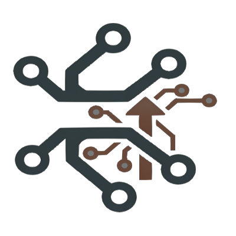

# GitAI

AI-powered `Git` toolkit that enhances workflow with intelligent commit messages, pull request generation, code reviews, changelogs, and more. It integrates with various LLM providers to automate and improve your development process.

## Features

- **Smart Commit Messages**: Generate meaningful commit messages based on your code changes
- **Commit Message Completion**: Complete partially typed commit messages with AI assistance
- **History-Aware Generation**: Use commit history for personalized and contextually appropriate messages
- **Pull Request Generation**: Automatically create detailed PR descriptions with context
- **Changelogs**: Generate release notes and changelogs from commit history
- **Multiple LLM Support**: Works with OpenAI, Anthropic, Google, and other providers
- **Git Config Integration**: Store configurations in Git config for project-specific settings
- **Wire Protocol Support**: Efficient caching and synchronization for remote repositories
- **Research & Evaluation Tools**: Built-in evaluation framework for commit message generation research

## Research Features

This toolkit implements features from the paper ["From Commit Message Generation to History-Aware Commit Message Completion"](https://arxiv.org/abs/2308.07655):

- **Commit Message Completion**: Complete messages with configurable context ratios (0%, 25%, 50%)
- **History Integration**: Incorporate author commit history for personalization
- **Evaluation Metrics**: B-Norm, Edit Similarity, and Exact Match metrics
- **Dataset Filtering**: Apply restrictive filters as used in previous CMG research
- **Batch Evaluation**: Run comprehensive experiments comparing different approaches

## License

Licensed under the MIT License. See [LICENSE.md](LICENSE.md) for details.
